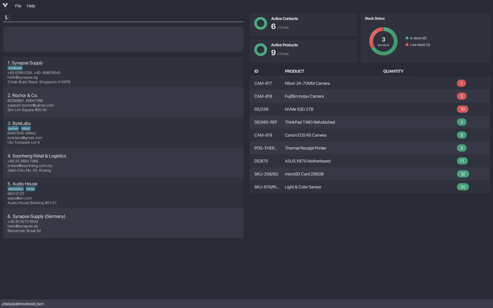

## Problem Statement
This product helps small business owners seamless manage vendor contacts and track inventory in one simple system. 
By flagging and sorting low-stock items, owners instantly know what needs restocking and who to contact, 
enabling timely action without relying on complex or costly inventory tools.

## Target Audience
This product is for small business owners with many vendors' contacts and inventory to keep track of 
and is someone who prefers CLI over GUI.

## Features to implement
- [ ] Find by every field
- [ ] Autocomplete for commands
- [ ] Sort commands
- [ ] Command aliases for faster typing
- [ ] More clearer error messages

This project is based on the AddressBook-Level3 project created by the [SE-EDU initiative](https://se-education.org).
