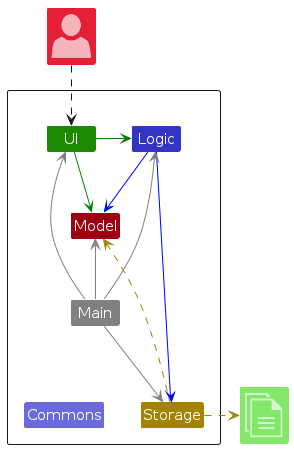
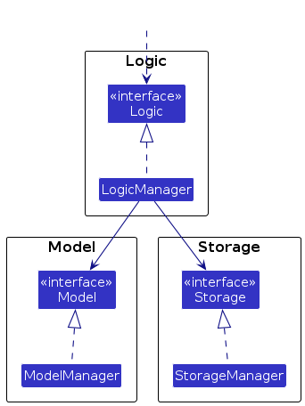
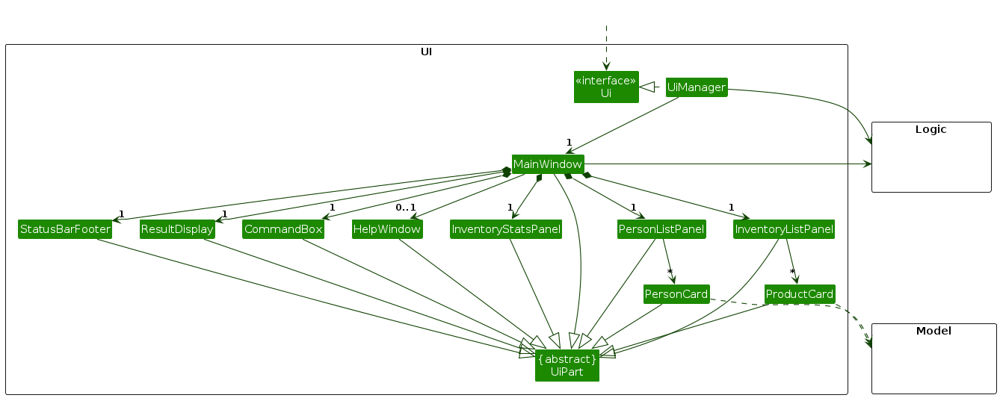
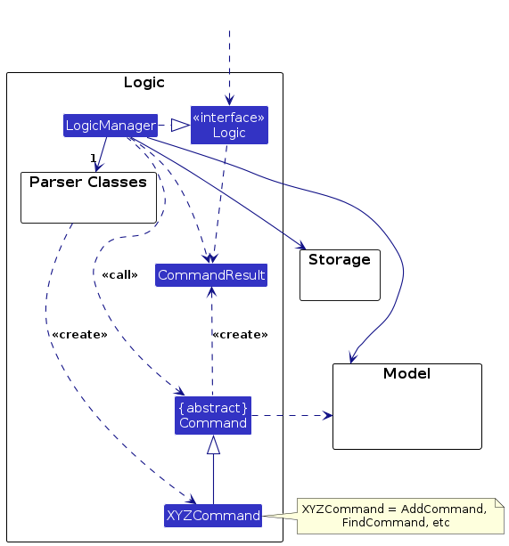
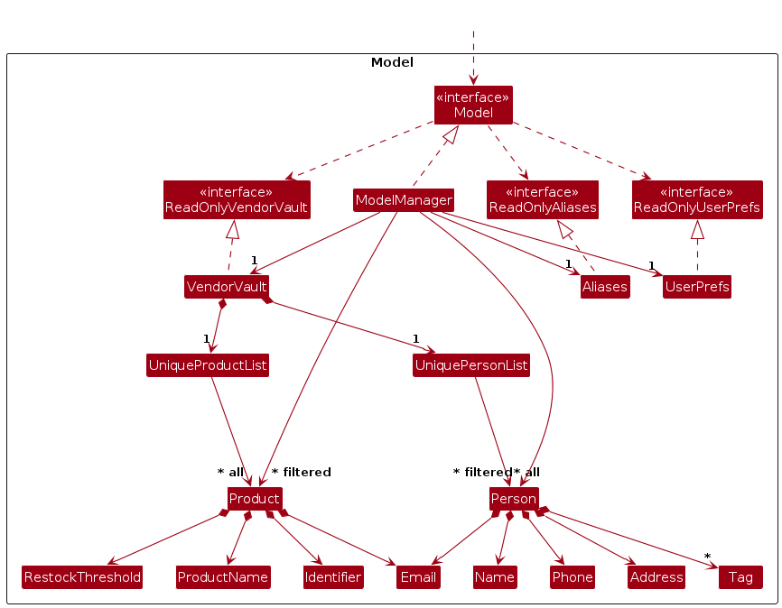
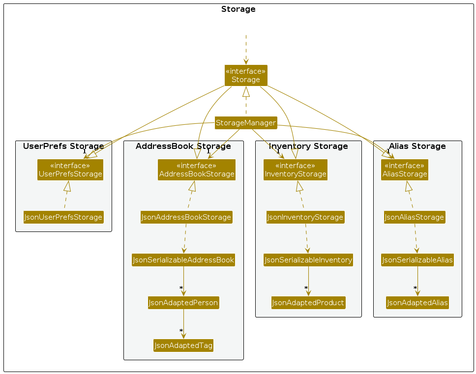

# VendorVault

This desktop app helps small business owners seamlessly manage vendors and inventory.

It combines the speed of typing commands with the simplicity of a visual interface, allowing them to organise vendors' contacts and 
track their products efficiently.

By flagging and sorting low-stock items, owners instantly know what needs restocking and who to contact, enabling 
timely action without relying on complex or costly inventory tools.

# Quick Start & Features

Refer to our [**User Guide**](https://ay2526s2-cs2103t-w08-2.github.io/tp/UserGuide.html#quick-start)

# Overview of Architecture

The app is divided into five main components: Main, UI, Logic, Model, and Storage. 

Each component defines its API in an interface of the same name and implements its functionality using a concrete `{Component Name}Manager` class. For example:

## Main

The component in charge of app launch, shutdown and application logging, consisting of classes [`Main`](https://github.com/AY2526S2-CS2103T-W08-2/tp/blob/master/src/main/java/seedu/address/Main.java) and [`MainApp`](https://github.com/AY2526S2-CS2103T-W08-2/tp/blob/master/src/main/java/seedu/address/MainApp.java). 

At launch, `MainApp` initializes all other components in the correct sequence. During user operation, it logs key events — successful data loads, recoverable warnings, and fallback actions. At shutdown, it ensures resources are flushed.

## UI

**API** : [`Ui.java`](https://github.com/AY2526S2-CS2103T-W08-2/tp/blob/master/src/main/java/seedu/address/ui/Ui.java)

Every UI component (`CommandBox`, `ResultDisplay`, `InventoryListPanel` etc.) inherit the abstract `UiPart` class, which captures common aspects of the visible GUI.

These components
* depend on `Person` and `Product` classes in the `Model` component to render their data.
* observe changes to `Model` to update the UI accordingly.
* display the feedback of command execution, which is received from the `Logic` component.

## Logic

**API** : [`Logic.java`](https://github.com/AY2526S2-CS2103T-W08-2/tp/blob/master/src/main/java/seedu/address/logic/Logic.java)

This component executes commands given by the user, such as `AddCommand`, `EditCommand`, and `FindCommand`.

`LogicManager` uses the corresponding `Parser` class to parse the command and create a `XYZCommand` object. All command classes inherit from the abstract `Command` class, so they can be treated similarly where possible.

## Model

**API** : [`Model.java`](https://github.com/AY2526S2-CS2103T-W08-2/tp/blob/master/src/main/java/seedu/address/model/Model.java)

The `Model` component holds app data in memory. The data is encapsulated in the following objects:
* `Person`/`Product`: all vendor and inventory data
* `ObservableList<Person>`/`ObservableList<Product>`: a subset of `Person`/`Product` objects to display
* `VersionedVendorVault`: the current snapshot of the app

## Storage

**API** : [`Storage.java`](https://github.com/AY2526S2-CS2103T-W08-2/tp/blob/master/src/main/java/seedu/address/storage/Storage.java)

This component reads app data from and writes it to the hard disk. The `Json...Storage` classes save the corresponding data — vendor, inventory, user preference — in JSON format.

## Commons

A collection of utility classes used by multiple components.

# Architectural Decisions

As the app is GUI-based and information needs to respond to typed commands, mouse and keyboard events, we adopted an event‑driven architecture and the MVC pattern.

**Model:** `ModelManager` and `VersionedVendorVault` serves as the single source of truth for the app state.

**View:** `UiPart` classes render `Person`/`Product` data and observe model changes via `ObservableList<Person>`/`ObservableList<Product>`.

**Controller:** `XYZParser` parses user intent and `XYZCommand` translates them into model changes.

# Contributing

_VendorVault is a brownfield project based on [SE-EDU initiative](https://se-education.org)'s AddressBook-Level3._

If you are interested in contributing to VendorVault, the [**Developer Guide**](https://ay2526s2-cs2103t-w08-2.github.io/tp/DeveloperGuide.html) is a good place to start.
