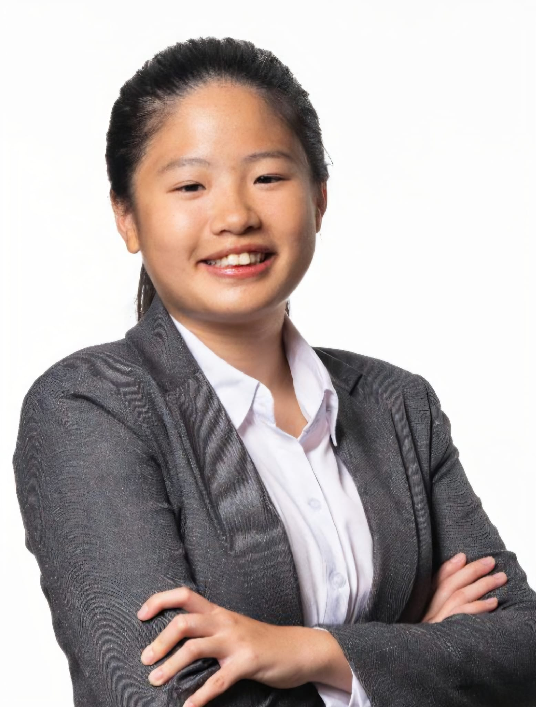
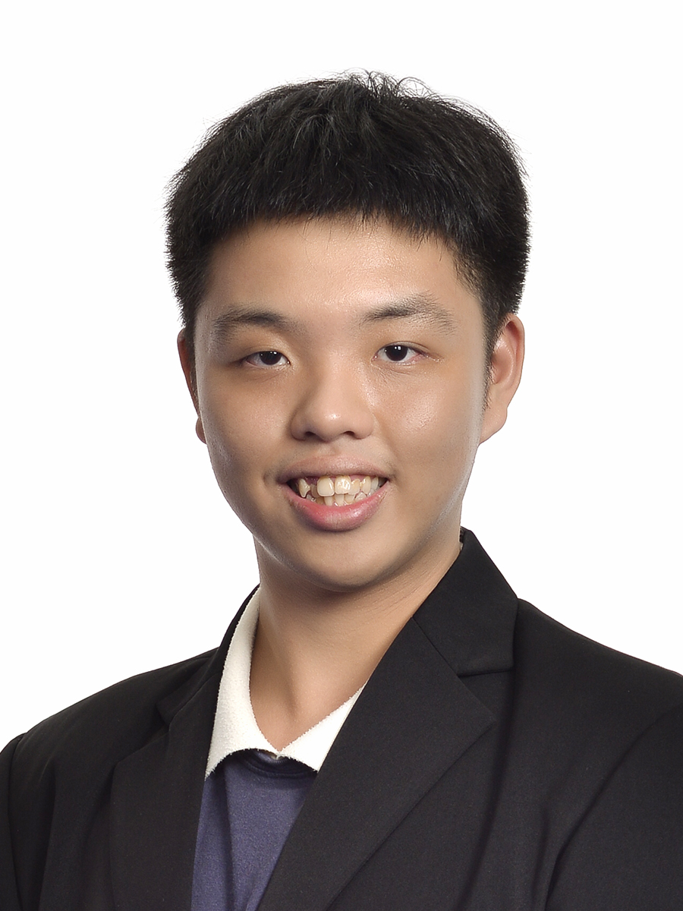
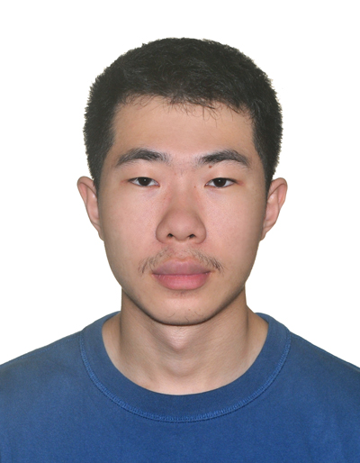

# About Us

We are a team based in the [School of Computing, National University of Singapore](http://www.comp.nus.edu.sg).

You can reach us at the email `seer[at]comp.nus.edu.sg`

## Project team

### Jolene

[[homepage](https://jolenechong.pages.dev/)]
[[github](https://github.com/github.com/jolenechong/)]
[[portfolio](team/jolenechong.md)]

* Role: Team Lead, Integration
* Responsibilities: Logic

### Aw Ming Xuan

[[github](https://github.com/icyyolo)]
[[portfolio](team/icyyolo.md)]

* Role: Deliverables and deadlines
* Responsibilities: Model

### Le Hua

[[github](http://github.com/l3hu4l1)] [[portfolio](team/l3hu4l1.md)]

* Role: Developer, Testing
* Responsibilities: Storage

### Shermaine

[[github](http://github.com/ShermainePeh08)]
[[portfolio](team/shermaine.md)]

* Role: Documentation
* Responsibilities: UI
