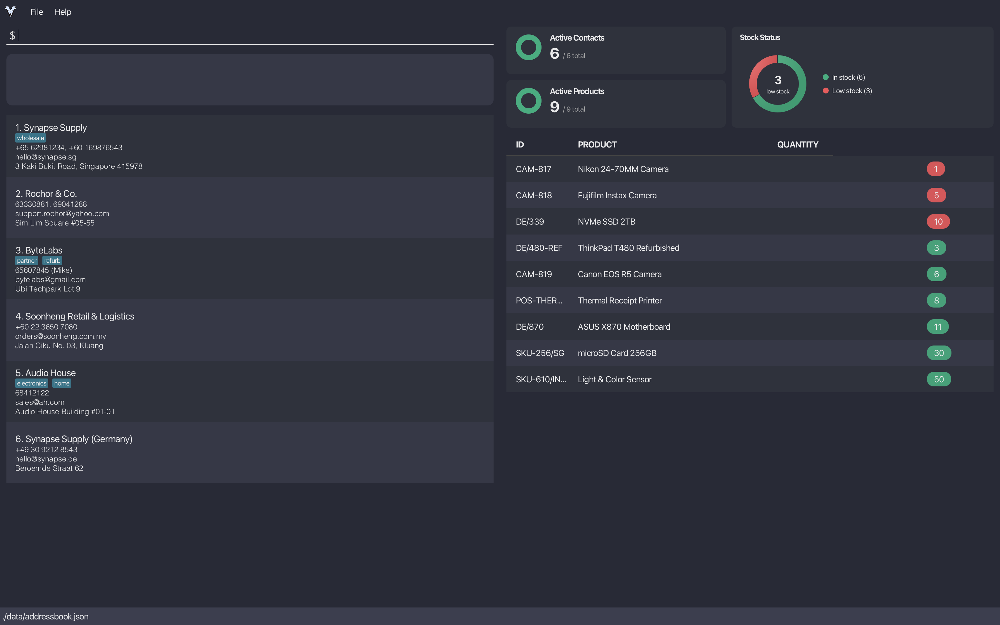

<br>

# VendorVault User Guide

VendorVault is a **desktop app for managing your vendors and inventory all in one place**. It combines the speed of typing commands with the simplicity of a visual interface, allowing you to update products, their quantities, track vendors, and organise their contacts quickly and efficiently, all optimised for use via a Command Line Interface (CLI).

Spend less time searching through spreadsheets and switching between apps. VendorVault keeps your business information organised so you can focus on what matters most: growing your business.

<br>

VendorVault is designed for:

* **Small business owners** managing vendor contacts and suppliers
* **Small business owners** who track inventory and vendor information
* **Users comfortable with typing commands** to quickly manage data

<!-- * Table of Contents -->
<page-nav-print />

<br>

--------------------------------------------------------------------------------------------------------------------

<br>

## Quick start

Follow these steps to get VendorVault up and running:

1. Ensure Java 17 or above is installed.
   * Full guide for installation [here](https://se-education.org/guides/tutorials/javaInstallation.html). If you are familiar with the process, you can download Java directly [here](https://www.oracle.com/asean/java/technologies/downloads/).<br>
   
   <box type="important" seamless>
   
     Mac users: Ensure you have the precise JDK version prescribed [here](https://se-education.org/guides/tutorials/javaInstallationMac.html).

   </box>

2. Download the latest version of VendorVault [here](https://github.com/AY2526S2-CS2103T-W08-2/tp).
    * Specifically, choose to download the `.jar` file.
    * If necessary, move the file to a folder you want to use as the _home folder_ for VendorVault.
<br><br>
3. Open a terminal for your OS and launch VendorVault:

<tabs>
  <tab header="Windows">

Open **Command Prompt** and run:

```bash
cd PATH_TO_FOLDER_CONTAINING_JAR_FILE
java -jar vendorvault.jar
```

For example, if you placed the `.jar` file in `C:\Users\John\Downloads`:

```bash
cd C:\Users\John\Downloads
java -jar vendorvault.jar
```

  </tab>
  <tab header="Mac">

Open **Terminal** and run:

```bash
cd PATH_TO_FOLDER_CONTAINING_JAR_FILE
java -jar vendorvault.jar
```

For example, if you placed the `.jar` file in your Downloads folder:

```bash
cd ~/Downloads
java -jar vendorvault.jar
```

  </tab>
  <tab header="Linux">

Open a **Terminal** and run:

```bash
cd PATH_TO_FOLDER_CONTAINING_JAR_FILE
java -jar vendorvault.jar
```

For example, if you placed the `.jar` file in a `vendorvault` folder in your home directory:

```bash
cd ~/vendorvault
java -jar vendorvault.jar
```

<box type="tip" seamless>

If you get a permission error, make the file executable first: `chmod +x vendorvault.jar`

</box>

  </tab>
</tabs>

   VendorVault should start up and you should see a GUI similar to the below in a few seconds. Note how the app contains some sample data.<br>
   
<br><br>
4. Now, we're ready to use the app! At the top left of the app, you should see a command box with the text `Type a
command here...`. This is where you can type in commands to interact with the app. You can also access the list of available commands by clicking on the `Help` menu at the top of the app or by pressing `F1` on your keyboard.
<br><br>
Some example commands you can try:

* `add n/TechSource Electronics p/61234567 e/sales@techsource.com a/15 Kallang Way, Singapore` : Adds a vendor contact named `TechSource Electronics` to VendorVault.

* `delete sales@techsource.com` : Deletes `TechSource Electronics`.

* `help`: View available commands within the app.

5\. Refer to the [Features](#features) below for details of each command. Or [Command Summary](#command-summary) for a quick summary of all commands.

<br>

--------------------------------------------------------------------------------------------------------------------

<br>

## Features

### Before you begin

<box type="definition" seamless>
<!-- <box type="important" seamless> -->


VendorVault keeps your data in one of three states. Understanding this will help you choose the right command every time:

| State        | What it means                                  | How to get there                                          |
|--------------|------------------------------------------------|-----------------------------------------------------------|
| **Active**   | Visible in the main list, fully usable         | Default / `restore` / `restoreproduct`                    |
| **Archived** | Hidden but recoverable, data is kept           | `archive` / `archiveproduct`                              |
| **Deleted**  | Permanently gone, cannot be recovered          | `delete` / `deleteproduct` / `clear` / `clearproduct`     |

When in doubt, **archive, don't delete.**

</box>

<div style="height: 20px;"></div>

<box type="info" seamless>

**Note about destructive commands:**

* You can use undo to restore the data only **within the same app session**. 
* If you may need the contact/product again in the future, consider using [`archive`](#archiving-a-contact-archive) / [`archiveproduct`](#archiving-a-product-archiveproduct) respectively.

</box>

<box type="info" seamless>

**Notes about the command format:**<br>

* To skip the confirmation prompt, use the `-y` flag: `deleteproduct -y PRODUCT_IDENTIFIER`

* Words in `UPPER_CASE` are the parameters to be supplied by the user.<br>
  e.g. in `add n/NAME`, `NAME` is a parameter which can be used as `add n/John Doe`.

* Items in square brackets are optional.<br>
  e.g. `n/NAME [t/TAG]` can be used as `n/John Doe t/friend` or as `n/John Doe`.

* Items with `…`​ after them can be used multiple times including zero times.<br>
  e.g. `[t/TAG]…​` can be used as ` ` (i.e. 0 times), `t/friend`, `t/friend t/family` etc.

* Parameters can be in any order.<br>
  e.g. if the command specifies `n/NAME p/PHONE_NUMBER`, `p/PHONE_NUMBER n/NAME` is also acceptable.

* Extraneous parameters for commands that do not take in parameters (such as `help`, `list`, `listproduct`, `exit`, `clear` and `clearproduct`) will be ignored.<br>
  e.g. if the command specifies `help 123`, it will be interpreted as `help`.

* If you are using a PDF version of this document, be careful when copying and pasting commands that span multiple lines as space characters surrounding line-breaks may be omitted when copied over to the application.
</box>

<div style="height: 20px;"></div>

### Viewing help : `help`

Shows a message explaining how to access the help page.


Format: `help`

<div style="height: 30px;"></div>

### Managing Vendor Contacts

<div style="height: 10px;"></div>

#### Adding a contact: `add`

Adds a contact to VendorVault.

Format:

```
add n/NAME p/PHONE_NUMBER e/EMAIL a/ADDRESS [t/TAG]…​
```

Examples:

* `add n/Adafruit Industries p/64601234 e/support@adafruit.com a/151 Varick St, New York, NY 10013, USA`
* `add n/Cytron Technologies Pte. Ltd. p/65480668 (Office), 91234567 (Sales) e/sg.sales@cytron.io a/09 Collyer Quay t/electronics`

<box type="tip" seamless>

**Tip:** A contact can have any number of tags or none at all.

</box>

<panel header="How can I include multiple phone numbers?" type="seamless">

To include multiple phone numbers for a contact, you can **separate them with commas** in the `p/` parameter.

For example, the following command adds a contact with two phone numbers: `61234567` and `87654321`:

```
add n/DigiKey Singapore p/61234567, 87654321 e/sg.sales@digikey.com a/71 Ayer Rajah Crescent, #05-18, Singapore 139951
```

</panel>

<panel header="What contacts are considered duplicates?" type="seamless" id="faq-duplicate-contacts">

A contact is considered a duplicate if:

* It has the **same email and phone number as an existing contact** in VendorVault.
* Phone numbers are compared while ignoring labels (such as “(Office)” or “(HP)”). Multiple phone numbers should be separated by commas.

For example, these contacts are considered duplicates because they share the same phone number `61234567` and email `contact@company.com`:<br>

```
add n/DigiKey Singapore p/61234567, 98765432 e/contact@company.com a/71 Ayer Rajah Crescent, #05-18, Singapore 139951
add n/DigiKey Singapore p/61234567, 12345678 e/contact@company.com a/71 Ayer Rajah Crescent, #05-18, Singapore 139951
```

</panel>

<br>

For more details on possible warnings and errors when adding a contact, refer to the [troubleshooting guide for add contact](#troubleshooting-add-contact) below.

<div style="height: 30px;"></div>

#### Listing all contacts : `list`

Shows a list of all **active** contacts in the VendorVault.

Format:

```
list
```

<div style="height: 30px;"></div>

#### Editing a contact : `edit`

Edits a contact using the given email. Only the fields you specify will be updated, all others stay the same.

Format:

```
edit EMAIL [n/NAME] [p/PHONE] [e/EMAIL] [a/ADDRESS] [t/TAG]…​
```

Examples:

* `edit support@adafruit.com p/98196742 a/New York, USA` Updates the phone number and address for `support@adafruit.com`. The name, email, and tags remain unchanged.
* `edit sg.sales@cytron.io n/Cytron t/` Updates the name to Cytron for `sg.sales@cytron.io` and clears all existing tags.

<panel header="What happens to a contact's existing tags when I edit them?" type="seamless">

The existing tags are **replaced with the new tags you specified**, adding new tags is not cumulative.

For example, if a contact has existing tags `t/electronics t/supplier` and you edit it with `edit EMAIL t/wholesale`, the contact's tags will be updated to only have `t/wholesale` and the previous tags will be removed.

</panel>

<panel header="How do I remove all tags from a contact?" type="seamless">

Simply type `t/` without specifying any tags.

For example, `edit EMAIL t/` will remove all tags from the contact with the specified email.

</panel>

<br>

The same rules for multiple phone numbers and duplicates that apply to `add` also apply to `edit`.
For more details on possible warnings and errors when editing a contact, refer to the [troubleshooting guide for edit contact](#troubleshooting-edit-contact) below.

<div style="height: 30px;"></div>

#### Locating contacts by name: `find`

Finds contacts whose names contain any of the given keywords (case-insensitive).

Format: 

```
find KEYWORD [MORE_KEYWORDS]
```

Examples:

* `find Industries Technologies` finds the contacts names that contains `Industries` or `Technologies`
* `find Industries` finds the contacts names that contains `Industries`

<panel header="Can I search by part of the name?" type="seamless">

No, the `find` command will match by full name, not partial name.

Example:
* If there is a company named `Adafruit Industries`
* `find fruit` will not find the company
* `find adafruit` will find the company

</panel>

<div style="height: 30px;"></div>

#### Archiving a contact : `archive`

Moves a contact to the archive. Archived contacts are hidden from the main list but are **not permanently deleted**. They can be restored at any time.

Format:

```
archive EMAIL
```

Examples:

* `archive sg.sales@cytron.io` archives the contact associated with the email `sg.sales@cytron.io`.

<box type="tip" seamless>

**Tip:** Archiving is the recommended way to remove vendors you no longer work with, but may need to reference in future. To permanently delete a contact, use [`delete`](#deleting-a-contact-delete).

</box>

<panel header="How do I view or recover archived contacts?" type="seamless">

Use [`restore`](#restoring-an-archived-contact-restore) without any argument to view all archived contacts. Then use `restore EMAIL` to bring a specific contact back to the active list.

</panel>

<div style="height: 30px;"></div>

#### Restoring an archived contact : `restore`

Moves a previously archived contact back to the active contact list. If `EMAIL` is omitted, VendorVault will display all archived contacts so you can find the one you want to restore.

Format:

```
restore EMAIL
```

Examples:

* `restore`: shows all archived contacts in the panel.
* `restore sg.sales@cytron.io`: restores the archived contact with email `sg.sales@cytron.io`.

<box type="info" seamless>

Only contacts that have been archived can be restored. If you try to restore an email that does not match any archived contact, VendorVault will show the archived contacts list to help you find the right email.

</box>

<div style="height: 30px;"></div>

#### Deleting a contact : `delete`

Removes a contact from the address book using their email address as the _unique identifier_
You will be prompted to confirm the deletion before any changes are made.

Format: 

```
delete EMAIL
```

Examples:

* `delete support@adafruit.com` deletes the contact associated with the email `support@adafruit.com`.

<div style="height: 30px;"></div>

#### Clearing all contacts: `clear`

Permanently removes all contacts from the address book.

Format: `clear`

<div style="height: 30px;"></div>

### Managing Inventory

#### Adding a product: `addproduct`

Adds a product to the inventory.

Format: 
```addproduct id/IDENTIFIER n/NAME [q/QUANTITY] [th/RESTOCK_THRESHOLD]```

<box type="tip" seamless>

**Tip:**
<br>
If quantity is not specified, it will default to 0.
<br>
If threshold is not specified, it will default to 0.

</box>

Examples:

* `addproduct id/Pr1 n/HP LaserJet (M428fdw) q/50 th/10`
* `addproduct id/DE/5 n/PlayStation`

<panel header="What products are considered duplicates?" type="seamless" id="faq-duplicate-products">

A product is considered a duplicate if it has the **same identifier (id) as an existing product**. For example, these products have the same identifier `SKU-1003`:

```
addproduct id/SKU-1003 n/Arduino Uno R4 Development Board
addproduct id/SKU-1003 n/Raspberry Pi 5 (8GB RAM)
```

</panel>
<div style="height: 30px;"></div>

#### Listing all products : `listproduct`

Shows a list of all **active** products in the inventory.

Format:

```
listproduct
```

<div style="height: 30px;"></div>

#### Editing a product : `editproduct` _(coming soon)_

<box type="info" seamless>

**This feature is currently in progress** and will be available in a future release. `editproduct` will allow you to update a product's name, quantity, or restock threshold without having to delete and re-add it.

</box>

<div style="height: 30px;"></div>

#### Archiving a product : `archiveproduct`

Moves a product to the archive. Archived products are hidden from the main inventory list but are **not permanently deleted**. They can be restored at any time using their identifier.

Format:

```
archiveproduct IDENTIFIER
```

Examples:

* `archiveproduct SKU-1003` archives the product with identifier `SKU-1003`.
* `archiveproduct SKU-2048` archives the product with identifier `SKU-2048`.


<box type="tip" seamless>

**Tip:** Use `archiveproduct` for products that are temporarily out of stock or discontinued, but may return. To permanently remove a product, use [`deleteproduct`](#deleting-a-product-deleteproduct).

</box>

<panel header="How do I view or recover archived products?" type="seamless">

Use [`restoreproduct`](#restoring-an-archived-product-restoreproduct) without any argument to display all archived products. Then run `restoreproduct IDENTIFIER` to restore the one you need.

</panel>

<div style="height: 30px;"></div>

#### Restoring an archived product : `restoreproduct`

Moves a previously archived product back to the active inventory list.

Format:

```
restoreproduct IDENTIFIER
```

* If `IDENTIFIER` is omitted, VendorVault will display all archived products so you can find the one you want to restore.

Examples:

* `restoreproduct`: shows all archived products in the panel.
* `restoreproduct SKU-1003`: restores the archived product with identifier `SKU-1003`.

<box type="info" seamless>

Only products that have been archived can be restored. If the identifier does not match any archived product, VendorVault will show the archived products list to help you find the correct identifier.

</box>

<div style="height: 30px;"></div>

#### Deleting a product : `deleteproduct`

Permanently removes a product from the inventory using its product identifier.
You will be prompted to confirm the deletion before any changes are made.

Format:

```
deleteproduct PRODUCT_IDENTIFIER
```

Examples:

* `deleteproduct SKU-1003` deletes the product with identifier `SKU-1003`.

<div style="height: 30px;"></div>

#### Clearing all products : `clearproduct`

Permanently removes **all** products from the inventory.

Format: `clearproduct`

<div style="height: 30px;"></div>

### Utility Commands

#### Add a command alias : `alias`

Create an alternative command word that triggers an existing command.

Format:
```
alias ALIAS ORIGINAL_COMMAND
```

Example:
* `alias` list all current aliases
* `alias ls list` maps `ls` as an alias for the `list` command

<div style="height: 30px;"></div>

#### Undoing the previous command : `undo`

Undoes the previous command that changed the data.

Format:

```
undo
```

<div style="height: 30px;"></div>

#### Redoing the previous undone command : `redo`

Redoes the previous undone command that changed the data.

Format:

```
redo
```

<div style="height: 30px;"></div>

#### Exiting the program : `exit`

Exits the program.

Format: `exit`

<div style="height: 30px;"></div>

--------------------------------------------------------------------------------------------------------------------

<br>

## Command Summary

### Contact Commands

| Action             | Command                                                                | Example                                                                                                    | What it does                             |
|--------------------|------------------------------------------------------------------------|------------------------------------------------------------------------------------------------------------|------------------------------------------|
| **Add Contact**    | `add n/NAME p/PHONE_NUMBER e/EMAIL a/ADDRESS [t/TAG]…​`               | `add n/TechSource Electronics p/61234567 e/sales@techsource.com a/15 Kallang Way, Singapore t/electronics` | Adds vendor contact                      |
| **Edit Contact**   | `edit EMAIL [n/NAME] [p/PHONE_NUMBER] [e/EMAIL] [a/ADDRESS] [t/TAG]…​` | `edit sales@techsource.com n/TechSource p/61234568`                                                        | Edits specified fields of vendor contact |
| **Delete Contact** | `delete EMAIL`                                                         | `delete sales@techsource.com`                                                                              | Deletes contact by email                 |
| **List**           | `list`                                                                 |                                                                                                            | Lists active contacts                       |
| **Find Contact**   | `find KEYWORD [MORE_KEYWORDS]`                                         | `find TechSource`                                                                                          | Lists all contacts matching `KEYWORD`    |
| **Clear Contacts** | `clear`                                                                |                                                                                                            | Clears all contacts                      |

<div style="height: 30px;"></div>

### Product Commands

| Action                  | Command                                                                 | Example                                                        | What it does                                                              |
|-------------------------|-------------------------------------------------------------------------|----------------------------------------------------------------|---------------------------------------------------------------------------|
| **Add Product**         | `addproduct id/IDENTIFIER n/NAME [q/QUANTITY] [th/RESTOCK_THRESHOLD]`  | `addproduct id/SKU-1003 n/Arduino Uno R4 q/50 th/10`          | Adds product                                                              |
| **List Products**       | `listproduct`                                                           |                                                                | Lists all active products                                                 |
| **Edit Product**        | `editproduct` _(coming soon)_                                           |                                                                | Edits a product's details                                                 |
| **Archive Product**     | `archiveproduct IDENTIFIER`                                             | `archiveproduct SKU-1003`                                      | Archives product (hidden, not deleted)                                    |
| **Restore Product**     | `restoreproduct [IDENTIFIER]`                                           | `restoreproduct SKU-1003`                                      | Restores archived product; lists all archived if no identifier given      |
| **Delete Product**      | `deleteproduct IDENTIFIER`                                              | `deleteproduct SKU-1003`                                       | Permanently deletes product by identifier                                 |
| **Clear Products**      | `clearproduct`                                                          |                                                                | Permanently clears all products                                           |

### General Commands

| Action    | Command | What it does               |
|-----------|---------|----------------------------|
| **Alias** | `alias` | Add a new alias            |
| **Undo**  | `undo`  | Undoes previous command    |
| **Redo**  | `redo`  | Redoes last undone command |
| **Help**  | `help`  | Shows help message         |
| **Exit**  | `exit`  | Exits VendorVault          |

--------------------------------------------------------------------------------------------------------------------

<br>

## FAQ

<panel header="I accidentally entered a command that changed the data. Can I undo that?" type="seamless">

Yes, you can undo the previous command that changed the data by using the `undo` command. For example, if you accidentally deleted a contact, simply enter `undo` and the contact will be restored.

</panel>

<panel header="I edited the data file directly and now VendorVault is not working. What should I do?" type="seamless">

If you edited the data file and it caused VendorVault to behave unexpectedly, you can try the following steps:

1. Restore from backup: If you made a backup of the data file before editing, you can restore the original data file by replacing the edited data files in the data folder with the backup.
2. Start with a new data file: If you do not have a backup, you can delete the existing data file (or move it to a different location for safekeeping) and start VendorVault again. This will create a new, empty data file.

</panel>

<panel header="How do I transfer my data to another computer?" type="seamless">

Follow these steps:

* Install VendorVault on the new computer (see [Quick Start](#quick-start)).
* On the old computer, open the folder where VendorVault's `.jar` file is located.
* Look for the `data` folder and copy it to an external/cloud storage.
* When you launch VendorVault on the new computer, a new `data` folder is created. Replace it with the old
  computer's folder.
* Relaunch VendorVault and you should see your data appear exactly as before.

</panel>

<panel header="How do I back up my data?" id="faq-backup-data" type="seamless">

* Open the folder where VendorVault's `.jar` file is located.
* Inside, locate the `data` folder, which contains `.json` files.
  * `addressbook.json`: stores contact details
  * `inventory.json`: stores product details
  * `aliases.json`: stores alias details
* Copy the `data` folder to a secure location of your choice

</panel>

<panel header="How do I edit my data directly?" type="seamless">

* Open the folder where VendorVault's `.jar` file is located.
* Inside, locate the `data` folder, which contains `.json` files.
<box type="warning" seamless>

Please follow this format carefully. Files that do not adhere to the required format will be considered invalid.

</box>

<panel header="`addressbook.json`: stores contact details" type="seamless">

This is the json for address book: 

```json
{
  "persons" : [ {
    "name" : NAME,
    "phone" : PHONE_NUMBER,
    "email" : EMAIL,
    "address" : ADDRESS,
    "tags" : [ TAGS ]
  } ]
}
```

</panel>

<panel header="`inventory.json`: stores product details" type="seamless">

This is the json for inventory:

```json
{
  "products" : [ {
    "identifier" : IDENTIFIER(string),
    "name" : NAME(string),
    "quantity" : QUANTITY(integer),
    "threshold" : THRESHOLD(interger),
    "vendorEmail" : VENDOR_EMAIL(email),
    "isArchived" : BOOLEAN(true/false)
  } ]
}
```

</panel>

<panel header="`aliases.json`: stores alias details" type="seamless">

This is the json for aliases:

```json
{
  "aliasList" : [ {
    "alias" : ALIAS,
    "originalCommand" : ORIGINAL_COMMAND
  } ]
}
```

</panel>


</panel>

<br>

--------------------------------------------------------------------------------------------------------------------

<br>

## Troubleshooting

<box type="important" seamless>

**Error** messages mean the command **did not succeed**.
<br>
**Warning** messages mean the command **succeeded**, but VendorVault is flagging a **possible issue**.

</box>

### Managing contacts
<div style="height: 30px;"></div>

#### Troubleshooting `add` contact

Use this section when `add` fails or returns a warning.

| Scenario                                                                         | Message shown                                                             | How to fix                                                        |
|----------------------------------------------------------------------------------|---------------------------------------------------------------------------|-------------------------------------------------------------------|
| Missing one or more required prefixes (`n/`, `p/`, `e/`, `a/`)                   | `Missing required field(s): ...`                                          | Include all required prefixed fields in your command.             |
| No prefixes at all                                                               | `All required prefixes are missing, ...`                                  | Use the full prefixed format, e.g. `add n/... p/... e/... a/...`. |
| Text appears before the first prefix                                             | `No non-prefix characters before prefix(es) is allowed, ...`              | Remove any text before `n/`.                                      |
| Same single-value field repeated (e.g. two `n/` or two `e/`)                     | `Multiple values specified for the following single-valued field(s): ...` | Keep only one value for each of `n/`, `p/`, `e/`, `a/`.           |
| Name is blank                                                                    | `Name should not be blank.`                                               | Provide a non-empty name after `n/`.                              |
| Name is too long                                                                 | `Name should be at most 256 characters.`                                  | Shorten the name.                                                 |
| Phone is blank/too short                                                         | `Phone number should not be empty and must be at least 3 digits.`         | Ensure each phone entry has at least 3 digits.                    |
| Email is blank                                                                   | `Email should not be blank.`                                              | Provide a non-empty email after `e/`.                             |
| Email format is invalid                                                          | `Email should be of the format local-part@domain ...`                     | Use a valid email format (e.g. `sales@vendor.com`).               |
| Address is blank                                                                 | `Address can take any values, and it should not be blank`                 | Provide a non-empty address after `a/`.                           |
| Address is too long                                                              | `Address should be at most 500 characters.`                               | Shorten the address.                                              |
| Tag contains non-alphanumeric characters                                         | `Tag names should be alphanumeric`                                        | Use letters/numbers only for each `t/` value.                     |
| Contact duplicates an existing contact by same email or overlapping phone number | `This vendor contact already exists with the same email or phone number.` | Change the phone/email, or edit the existing contact instead.     |

Common `add` warnings:

| Warning trigger                        | Warning shown                                                                                                          | What it means                                                                                                                                                                            |
|----------------------------------------|------------------------------------------------------------------------------------------------------------------------|------------------------------------------------------------------------------------------------------------------------------------------------------------------------------------------|
| Name has unusual symbols               | `⚠ Warning: Name contains unusual symbols, is this intentional?`                                                       | Name is accepted, but looks unusual. You can verify if you entered the correct name.                                                                                                     |
| Phone includes unusual symbols/format  | `⚠ Warning: Phone number contains unusual symbols, is this intentional?`                                               | Phone is accepted, but format may be unintended. You can safely ignore it if you're providing labels eg. `61234567 (Office)`                                                             |
| Email is unusually long                | `⚠ Warning: This email address is unusually long, is this intentional?`                                                | Email is accepted, but unusually long. You can verify if the email entered is correct.                                                                                                   |
| Similar name to an existing contact    | `⚠ Warning: There's a contact with a similar name (name: <similar-name>), is this intentional?`                        | Possible duplicate by similar name. You can check if the name in the warning message is the same vendor as what you were about to add.                                                   |
| Similar address to an existing contact | `⚠ Warning: There's a contact with a similar address (name: <name>, address: <similar-address>), is this intentional?` | Possible duplicate/related location by address similarity. You can check if the vendor name and address in the warning message belongs to the same vendor as what you were about to add. |

<box type="tip" seamless>

Tip: If multiple warnings apply, VendorVault shows all of them (one per line) together with the success message.

</box>
<div style="height: 30px;"></div>

#### Troubleshooting `edit` contact

Use this section when `edit` fails or returns a warning.
<box type="info" seamless>

Many errors that occur in `add` also apply to `edit`, specifically, all except the first three errors listed in the add contact section above also apply. Similarly, all warnings from `add` apply to `edit` as well. For these shared errors, refer to the [Troubleshooting add contact](#troubleshooting-add-contact) guide, as they behave the same way in edit contact commands.

</box>


| Scenario                                                              | Message shown                                    | How to fix                                                              |
|-----------------------------------------------------------------------|--------------------------------------------------|-------------------------------------------------------------------------|
| Missing/invalid target email (or extra non-prefixed text after email) | `Invalid command format! ...`                    | Follow the syntax `edit EMAIL [n/...] [p/...] [e/...] [a/...] [t/...]`. |
| No fields specified to edit                                           | `At least one field to edit must be provided.`   | Include at least one of `n/`, `p/`, `e/`, `a/`, or `t/`.                |
| Target email not found                                                | `No contact with the specified email was found.` | Check the contact exists and re-run with the correct existing email.    |

<box type="tip" seamless>

Tip: Unlike `add`, edit command warnings only appear for **fields you are actually editing**. For example, if you edit only the phone number and there's a similar name in the database, you won't see a name warning. This prevents unnecessary alerts for unchanged fields.

</box>

<div style="height: 30px;"></div>

#### Troubleshooting `archive` contact

Use this section when `archive` fails.

| Scenario                           | Message shown                             | How to fix                                                                     |
|------------------------------------|-------------------------------------------|--------------------------------------------------------------------------------|
| No email provided                  | `Email must be provided.`                 | Provide the vendor's email: `archive EMAIL`.                                   |
| Email does not match any contact   | `No vendor found with email: EMAIL`       | Check the email is correct and that the contact exists in the active list.     |

<div style="height: 30px;"></div>

#### Troubleshooting `restore` contact

Use this section when `restore` fails.

| Scenario                                        | Message shown                                                         | How to fix                                                                         |
|-------------------------------------------------|-----------------------------------------------------------------------|------------------------------------------------------------------------------------|
| Email provided but no matching archived contact | `No archived vendor found with email: EMAIL` (archived list is shown) | Check the email is correct. The archived contacts panel will be shown to help you. |

<div style="height: 30px;"></div>

#### Troubleshooting `addproduct` contact

Use this section when `addproduct` fails or returns a warning.

| Scenario                                            | Message shown                                                             | How to fix                                                    |
|-----------------------------------------------------|---------------------------------------------------------------------------|---------------------------------------------------------------|
| Missing one or more required prefixes (`id/`, `n/`) | `Missing required field(s): ...`                                          | Include all required prefixed fields in your command.         |
| No prefixes at all                                  | `All required prefixes are missing, ...`                                  | Use the full prefixed format, e.g. `addproduct id/... n/...`. |
| Text appears before the first prefix                | `No non-prefix characters before prefix(es) is allowed, ...`              | Remove any text before `id/`.                                 |
| Same single-value field repeated (e.g. two `q/`)    | `Multiple values specified for the following single-valued field(s): ...` | Keep only one value for each of `id/`, `n/`, `q/`, `th/`.     |
| Identifier is blank                                 | `Identifier should not be blank.`                                         | Provide a non-empty identifier after `id/`.                   |
| Name is too long                                    | `Name should be at most 120 characters.`                                  | Shorten the name.                                             |
| Product is a duplicate                              | `This product already exists with the same identifier.`                   | Change the identifier, or edit the existing product instead.  |

<br>

Common `addproduct` warnings:

| Warning trigger                     | Warning shown                                                                                                                                   | What it means                                                                                                                   |
|-------------------------------------|-------------------------------------------------------------------------------------------------------------------------------------------------|---------------------------------------------------------------------------------------------------------------------------------|
| Identifier/Name has unusual symbols | `⚠ Warning: Identifier contains unusual symbols, is this intentional?`<br><br/>`⚠ Warning: Name contains unusual symbols, is this intentional?` | Identifier/Name is accepted, but looks unusual. You can verify if you entered it correctly.                                     |
| Similar name to an existing product | `⚠ Warning: There's a product with a similar name (name: <similar-name>), is this intentional?`                                                 | Possible duplicate by similar name. You can check if the name in the warning message is the same as what you were about to add. |

<div style="height: 30px;"></div>

#### Troubleshooting `archiveproduct`

Use this section when `archiveproduct` fails.

| Scenario                              | Message shown                                  | How to fix                                                                      |
|---------------------------------------|------------------------------------------------|---------------------------------------------------------------------------------|
| No identifier provided                | (usage message shown)                          | Provide the product identifier: `archiveproduct IDENTIFIER`.                    |
| Identifier does not match any product | `No product found with identifier: IDENTIFIER` | Check the identifier is correct and that the product exists in the active list. |

<div style="height: 30px;"></div>

#### Troubleshooting `restoreproduct`

Use this section when `restoreproduct` fails.

| Scenario                                             | Message shown                                                                 | How to fix                                                                                            |
|------------------------------------------------------|-------------------------------------------------------------------------------|-------------------------------------------------------------------------------------------------------|
| Identifier provided but no matching archived product | `No archived product found with identifier: IDENTIFIER` (archived list shown) | Check the identifier is correct. The archived products panel will be shown to help you identify the right one. |

<div style="height: 30px;"></div>

#### Troubleshooting `deleteproduct`

Use this section when `deleteproduct` fails.

| Scenario                              | Message shown                                     | How to fix                                                                |
|---------------------------------------|---------------------------------------------------|---------------------------------------------------------------------------|
| No identifier provided                | `Invalid command format! ...`                     | Provide the product identifier: `deleteproduct IDENTIFIER`.               |
| Identifier does not match any product | `No product found with the specified identifier.` | Ensure the product exists in the active list. Use `listproduct` to check. |

<div style="height: 30px;"></div>

#### Troubleshooting `clearproduct`

Use this section when `clearproduct` fails.

| Scenario                 | Message shown         | How to fix                                                    |
|--------------------------|-----------------------|---------------------------------------------------------------|
| Extra arguments provided | `Usage: clearproduct` | `clearproduct` takes no arguments. Run it as: `clearproduct`. |
